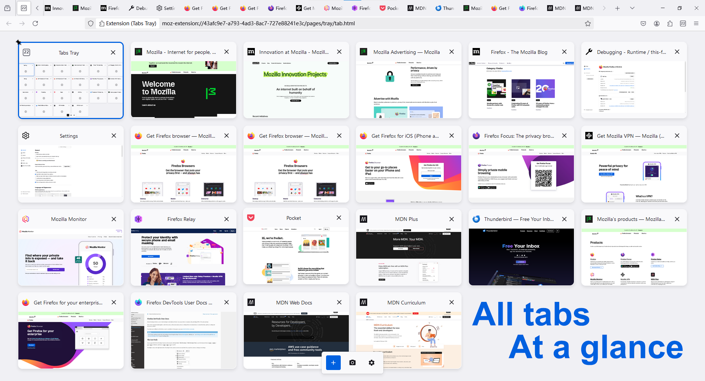
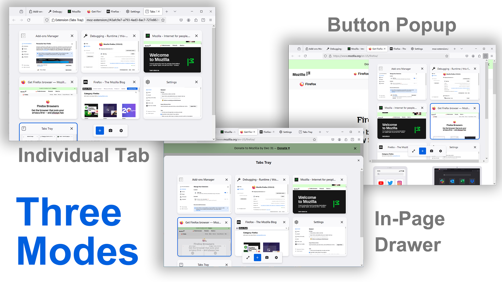
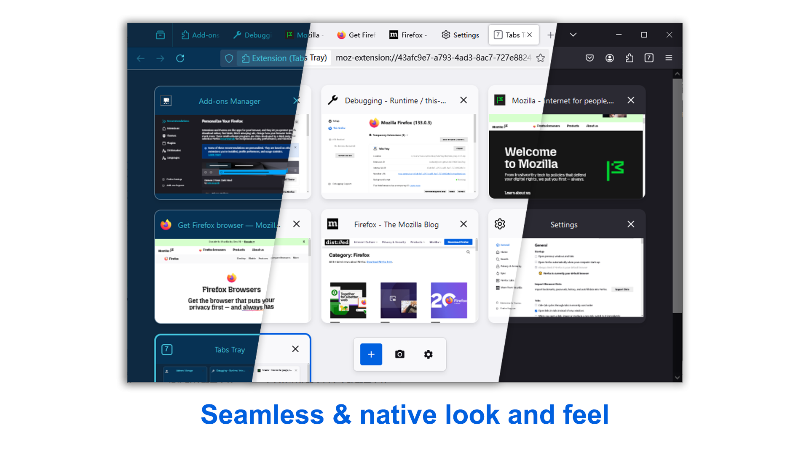
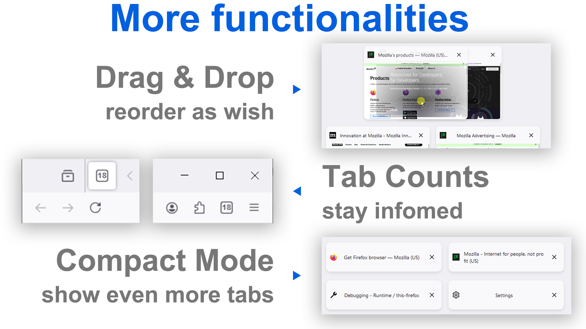

#  Tabs Tray

**Tired of endlessly scrolling through the cramped tab bar?
Make the most of your spacious desktop monitor!**

**Tabs Tray** transforms your browsing experience by laying out all your tabs on the screen, neatly and orderly.

With titles and thumbnails presented, you can effortlessly spot and switch to the tab you need, at a glance.

**Features:**

- **Seamless Integration**: Adapts to your browser theme for a native look and feel.
- **Versatile Display Options**: Choose from Tab, Popup, or Drawer modes to suit your workflow.
- **Real-Time Tab Count**: Stay informed with tab counts displayed on the extension button and tab mode icon.
- **Intuitive Tab Management**: Easily create, close, or reorder tabs with drag-and-drop functionality.
- **Compact Mode**: Collapse thumbnails, to fit even more tabs on one screen.

## Screenshots

|  |  |  |  |
| --------------------------------------------- | ------------------------------- | ----------------------------------------------- | ----------------------------------------------- |


## Install

[](https://addons.mozilla.org/zh-CN/firefox/addon/tabs-tray/)

[Chrome Support?](https://github.com/du33169/TabsTray/issues/1)

## Usage

Once installed, click the extension button or use the shortcut (<kbd>Alt+A</kbd> by default) to launch Tabs Tray. You can easily view and manage your tabs or click on one to switch to it.

Three modes are available:
<ul> 
<li><b>Individual Tab:</b> Utilizes the full content area with all features available.</li> 
<li><b>Extension Popup:</b> A flexible popup window launched from the extension button.</li> 
<li><b>In-Page Drawer:</b> Opens a drawer within the current active tab for quick access. (Note: This mode is unavailable on some restricted sites, such as <i>addons.mozilla.org</i>.)</li>
 </ul> 

## Build

1. Install [Bun](https://bun.sh/).
2. Install dependencies:
	```bash
	bun install .
	```
3. Build:
	```bash
	# dev build 
	bun run dev
	```
	Output to `./build` directory.

4. Test extension in firefox using `about:debugging#/runtime/this-firefox`.

## Todo

- [ ] [Firefox only] Right click menu with browser tab operations (menus.overrideContext)
- [ ] Publish
- [ ] Landing Page on install
- [ ] Tooltip to show thumbnail on hover under compact mode
- [ ] i18n
- [ ] Customize Action bar position
- [ ] Multi-Drag Mode (Selection Mode)
- [ ] Filter bar (title and url)

## Known Issues

- [ ] Drag-Drop Function conflict with other tab management extensions, for example, Tree Style Tab
- [ ] tab icon color not updated on theme update (In-page drawer)
- [ ] Popup not expanding under some situation